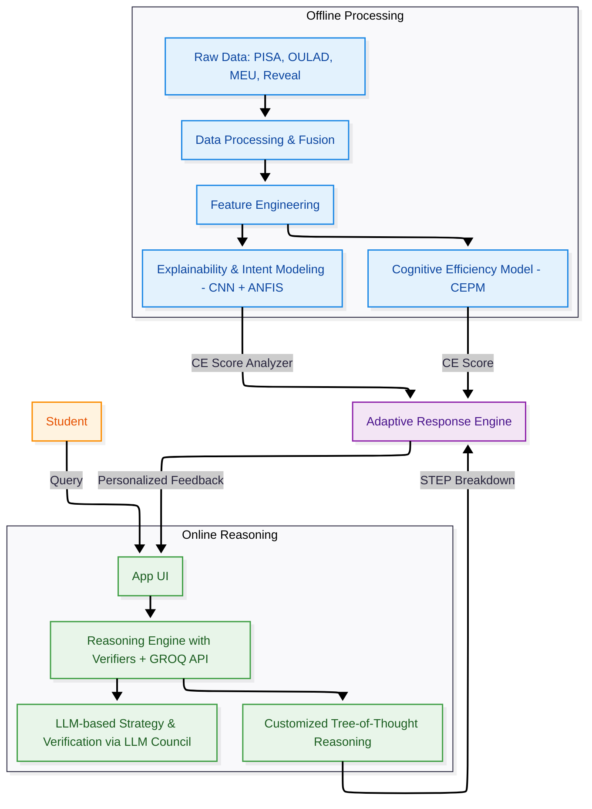

# CERAS — Cognitive Efficiency & Reasoning Alignment System

> [!CAUTION]
> **PROPRIETARY SOURCE CODE**
> This repository is protected by a proprietary license. Unauthorized copying, modification, or distribution is strictly prohibited. See [LICENSE](LICENSE) for details.


**CERAS** is a **Solver-Grounded, Multi-Verifier AI Tutor** that measures *cognitive learning readiness* in real-time. It goes beyond simple chatbots by "thinking" before it answers—using a **Tree-of-Thoughts (ToT)** architecture to decompose problems, verify logic, and adapt its teaching style based on the student's cognitive load.


---

## 🏗️ System Architecture

The core of CERAS is a **System 2 Reasoning Engine** that separates *planning* (decomposition) from *execution* (solving) and *verification*.



---

## 🚀 Key Features

### 1. **Solver-Grounded Reasoning**
Unlike standard LLMs that hallucinate, CERAS uses a rigid **Reasoning Pipeline**:
1.  **Decomposition**: Breaks complex queries (e.g., "Explain Quantum Entanglement") into atomic, pedagogical sub-problems.
2.  **Tree Search**: Explores multiple reasoning paths using Depth-First Search (DFS) on a custom Tree Data Structure.
3.  **Strict Verification**: Every step is double-checked by a specialized "Verifier" model before being shown to the user.

### 2. **Real-Time Cognitive Diagnostics**
The system doesn't just grade *correctness*; it grades *efficiency*.
-   **CE Score (Cognitive Efficiency)**: A 0-1 metrics combining behavioral speed, focus, and logical consistency.
-   **Intention Clustering**: Uses 1D-CNNs to detect browsing patterns (e.g., "Rushing", "Struggling", "Flow State").

### 3. **Adaptive "Theory of Mind"**
The AI adjusts its personality based on the student's state:
-   **Low CE (< 0.5)**: *Supportive & Detailed*. Breaks things down further.
-   **High CE (> 0.8)**: *Challenging & Concise*. Pushes for mastery.

### 4. **Interactive Learning Dashboard**
A modern Streamlit UI providing:
-   **Example Prompts**: "Good" vs "Bad" examples to train students on effective questioning.
-   **Live Telemetry**: Real-time visualization of Formulation Time, System Latency, and Cognitive Load.
-   **Session Reports**: Downloadable JSON summaries of the learning session.

---

## 🛠️ Tech Stack

| Component | Technology | Role |
| :--- | :--- | :--- |
| **LLM Backend** | **Groq API** | Ultra-low latency inference (Llama 3.3 70b, Llama 3.1 8b) |
| **Orchestration** | **LangChain** | Chain management and prompt engineering |
| **Interface** | **Streamlit** | Interactive web dashboard for students |
| **ML Models** | **LightGBM / PyTorch** | Cognitive Efficiency Prediction (CEPM) & CNN Feature Extraction |
| **Data Logic** | **Python (NetworkX)** | Tree-of-Thoughts graph management |
| **Fuzzy Logic** | **Custom ANFIS** | Neuro-Fuzzy alignment of reasoning scores |

---

## 💻 Setup & Installation

### Prerequisites
-   Python 3.12+
-   Conda
-   **Groq API Key** (Required for reasoning engine)

### Installation
1.  **Clone the repository**:
    ```bash
    git clone https://github.com/Wolfie8935/CERAS-Cognitive-Efficiency-Reasoning-Alignment-System.git
    cd ceras
    ```

2.  **Create Environment**:
    ```bash
    conda env create -f environment.yml
    conda activate ceras
    ```

3.  **Configure Credentials**:
    Create a `.env` file in the root directory:
    ```bash
    GROQ_API_KEY=gsk_your_key_here
    ```

4.  **Run the Application**:
    Navigate to the source directory and launch Streamlit:
    ```bash
    cd src/ceras
    streamlit run streamlit_app.py
    ```

---

## 📂 Project Structure

```text
├── 📁 artifacts
│   ├── 📄 anfis_features.npy
│   ├── 📄 anfis_model.pkl
│   ├── 📄 cepm_features.npy
│   ├── 📄 cepm_lightgbm.pkl
│   ├── 📄 cepm_scaler.pkl
│   ├── 📄 cnn_ce_model.keras
│   └── 📄 cnn_features.npy
├── 📁 data
│   ├── 📝 README.md
│   ├── 📄 data_clean_and_explore.ipynb
│   ├── 📄 download_data.ipynb
│   └── 📄 pisa_data.ipynb
├── 📁 docs
│   ├── 📝 archi.md
│   ├── 🖼️ image.png
│   └── 📝 literature_survey.md
├── 📁 experiments
│   └── 🐍 run_experiment.py
├── 📁 features
│   ├── 🐍 feature_quality.py
│   └── 🐍 featurize.py
├── 📁 graphs
│   ├── 📄 intention_cluster_means.csv
│   ├── 🖼️ intention_cluster_means.png
│   ├── 🖼️ shap_bar.png
│   └── 🖼️ shap_summary.png
├── 📁 models
│   ├── 🐍 anfis.py
│   ├── 🐍 cepm.py
│   └── 🐍 cnn.py
├── 📁 monitoring
│   ├── 🐍 alerts.py
│   └── 🐍 reports.py
├── 📁 notebooks
│   ├── 📄 01_data_explore.ipynb
│   └── 📄 02_baseline_model.ipynb
├── 📁 outputs
│   └── ⚙️ .gitkeep
├── 📁 postprocess
│   ├── 🐍 calibrator.py
│   └── 🐍 model_monitor.py
├── 📁 postprocess_store
│   └── 📄 ce_calibrator.joblib
├── 📁 preprocess
│   ├── 🐍 auditor.py
│   ├── 🐍 ce_builder.py
│   ├── 🐍 cog_student.py
│   ├── 🐍 questionnaire_student.py
│   └── 🐍 signal_fusion.py
├── 📁 src
│   ├── 📁 ceras
│   │   ├── 🐍 CAMRE_EDU.py
│   │   ├── 🐍 __init__.py
│   │   ├── 📄 edu_module_tests.ipynb
│   │   ├── 📄 experiments.ipynb
│   │   ├── 🐍 fusion.py
│   │   ├── 🐍 inference.py
│   │   ├── 🐍 llm_utils.py
│   │   ├── 🐍 main.py
│   │   ├── 🐍 pipeline_1.py
│   │   ├── 📝 project.md
│   │   ├── 🐍 streamlit_app.py
│   │   ├── 📄 testing.ipynb
│   │   ├── 🐍 tree_of_thoughts.py
│   │   ├── ⚙️ tree_of_thoughts_example.json
│   │   └── ⚙️ tree_of_thoughts_simple.json
│   └── 📁 ceras.egg-info
│       ├── 📄 PKG-INFO
│       ├── 📄 SOURCES.txt
│       ├── 📄 dependency_links.txt
│       └── 📄 top_level.txt
├── 📁 tests
│   ├── 🐍 test_features.py
│   ├── 🐍 test_monitoring.py
│   ├── 🐍 test_postprocess.py
│   └── 🐍 test_preprocess.py
├── ⚙️ .gitignore
├── 📄 LICENSE
├── 📝 README.md
├── 🐍 check_conn_simple.py
├── 🐍 data_loader.py
├── 🐍 data_loader_pisa.py
├── 🐍 debug_decomposition.py
├── ⚙️ environment.yml
├── 📝 final_architecture.md
├── ⚙️ pyproject.toml
├── ⚙️ pytest.ini
├── 📄 requirements.txt
├── 🐍 run_calibrator.py
├── 🐍 run_preprocess.py
├── 🐍 test_model_names.py
├── ⚙️ tree_of_thoughts_example.json
├── 🖼️ tree_of_thoughts_substantive.png
└── 🐍 verify_groq_connection.py
```

---

## 📜 License

**Copyright (c) 2026 Wolfie8935 and Rishaan08. All Rights Reserved.**

This software is provided for reference only. You may view the code, but you may not use, copy, modify, merge, publish, or distribute it without explicit written permission. See [LICENSE](LICENSE) for full text.
