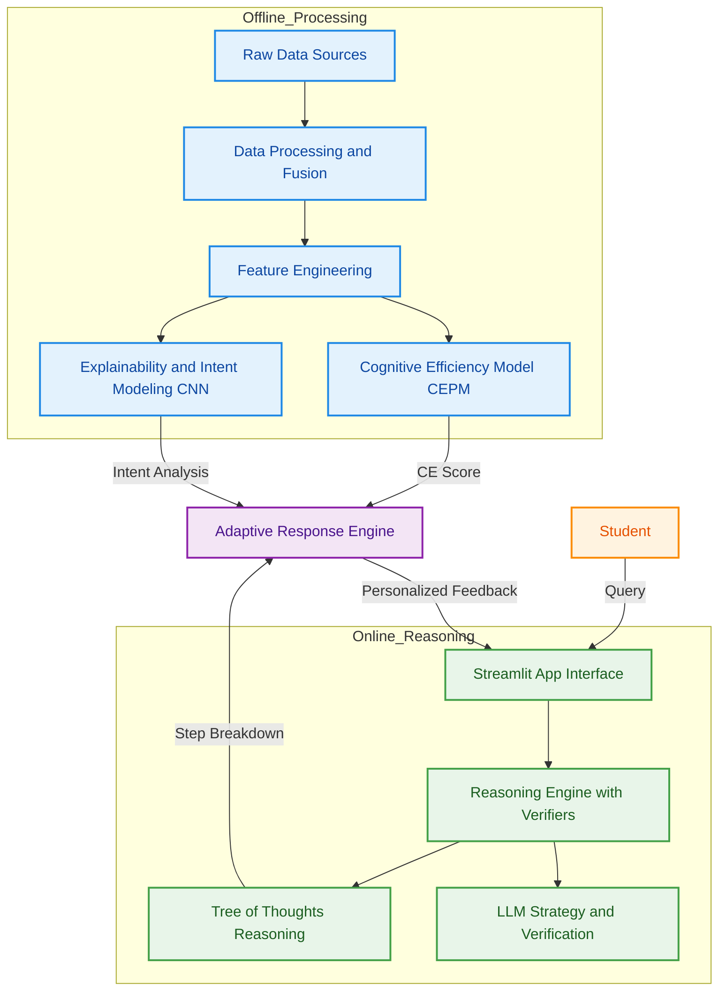

# CERAS — Cognitive Efficiency & Reasoning Alignment System

> [!CAUTION]
> **PROPRIETARY SOURCE CODE**
> This repository is protected by a proprietary license. Unauthorized copying, modification, or distribution is strictly prohibited. See [LICENSE](LICENSE) for details.


**CERAS** is a **Solver-Grounded, Multi-Verifier AI Tutor** that measures *cognitive learning readiness* in real-time. It goes beyond simple chatbots by "thinking" before it answers—using a **Tree-of-Thoughts (ToT)** architecture to decompose problems, verify logic, and adapt its teaching style based on the student's cognitive load.


---

## 🏗️ System Architecture

The core of CERAS is a **System 2 Reasoning Engine** that separates *planning* (decomposition) from *execution* (solving) and *verification*.



---

## 🚀 Key Features

### 1. **Premium Cognitive Interface**
-   **Adaptive Dashboard**: A sleek, dark-mode UI with gradient-styled "Good Examples" and a "Bad Examples" warning section.
-   **Live Telemetry**: Real-time visualization of Formulation Time, Processing Latency, and Token Count.
-   **Diagnostics**: Expandable reports detailing "Strengths" and "Suggestions" based on your prompt's density and structure.

### 2. **Deep Reasoning Pipeline (ToT)**
Unlike standard LLMs, CERAS uses a structured **Tree-of-Thoughts** architecture:
1.  **Generate**: Proposes multiple high-level strategies and step-by-step plans.
2.  **Verify**: Each path is rigorously checked by a specialized "Verifier" model (e.g., Llama-3.1-8b).
3.  **Select**: The optimal path is chosen based on verification scores.
4.  **Polish**: The final output is synthesized into a coherent learning response.

### 3. **Cognitive Efficiency Analysis**
The system evaluates your prompt using a fused multi-modal approach:
-   **CEPM (Structural)**: Measures complexity, density, and constraint adherence.
-   **CNN (Semantic)**: Analyzes intent clarity and alignment with high-performance patterns.
-   **Fused Score**: A holistic 0-1 metric guiding the adaptive response engine.

### 4. **Multi-Model Support**
Seamlessly switch between top-tier models for both Reasoning and Verification:
-   **Groq**: Llama-3.3-70b (Versatile), Llama-3.1-8b (Instant), Qwen 2, Mixtral.
-   **Gemini**: Gemini 1.5 Pro, Gemini 1.5 Flash, Gemini 1.0 Pro.

---

## 🛠️ Tech Stack

| Component | Technology | Role |
| :--- | :--- | :--- |
| **LLM Backend** | **Groq & Google Gemini** | High-performance inference for Main Reasoning and Verification |
| **Orchestration** | **LangChain** | Advanced chain management and direct API integration |
| **Interface** | **Streamlit** | Premium interactive dashboard with custom CSS styling |
| **ML Models** | **LightGBM / TensorFlow** | Cognitive Efficiency Prediction (CEPM) & CNN Feature Extraction |
| **Fusion** | **Pandas / Numpy** | Weighted averaging and logic-based score fusion |

---

## 💻 Setup & Installation

### Prerequisites
-   Python 3.10+
-   Conda
-   **Groq API Key**
-   **Gemini API Key**

### Installation
1.  **Clone the repository**:
    ```bash
    git clone https://github.com/Wolfie8935/CERAS-Cognitive-Efficiency-Reasoning-Alignment-System.git
    cd ceras
    ```

2.  **Create Environment**:
    ```bash
    conda env create -f environment.yml
    conda activate ceras
    ```

3.  **Run the Application**:
    ```bash
    cd src/ceras
    streamlit run streamlit_app.py
    ```

4.  **Configure Keys**:
    Enter your API keys directly in the application sidebar or set them as environment variables.

---

## 📂 Project Structure

```text
.
├── LICENSE
├── README.md
├── __pycache__
│   └── data_loader.cpython-312.pyc
├── artifacts
│   ├── cepm_features.npy
│   ├── cepm_lightgbm.pkl
│   ├── cepm_scaler.pkl
│   ├── cnn_ce_model.keras
│   ├── cnn_features.npy
│   └── cnn_scaler.pkl
├── check_conn_simple.py
├── data
│   ├── README.md
│   ├── pisa_data.ipynb
│   └── raw
│       └── synthetic_prompt.parquet
├── debug_decomposition.py
├── docs
│   ├── archi.md
│   ├── image.png
│   └── literature_survey.md
├── environment.yml
├── experiments
│   └── run_experiment.py
├── final_architecture.md
├── graphs
│   ├── intention_cluster_means.csv
│   ├── intention_cluster_means.png
│   └── shap_summary.png
├── models
│   ├── __init__.py
│   ├── __pycache__
│   │   ├── __init__.cpython-312.pyc
│   │   └── anfis.cpython-312.pyc
│   ├── cepm.py
│   └── cnn.py
├── monitoring
│   ├── __pycache__
│   │   ├── alerts.cpython-312.pyc
│   │   └── reports.cpython-312.pyc
│   ├── alerts.py
│   └── reports.py
├── notebooks
│   ├── 01_data_explore.ipynb
│   └── 02_baseline_model.ipynb
├── outputs
├── pipeline_debug.log
├── postprocess
│   ├── __pycache__
│   │   ├── calibrator.cpython-312.pyc
│   │   ├── insights.cpython-312.pyc
│   │   └── model_monitor.cpython-312.pyc
│   └── model_monitor.py
├── pyproject.toml
├── pytest.ini
├── requirements-render.txt
├── requirements.txt
├── src
│   ├── ceras
│   │   ├── CAMRE_EDU.py
│   │   ├── __init__.py
│   │   ├── __pycache__
│   │   ├── edu_module_tests.ipynb
│   │   ├── experiments.ipynb
│   │   ├── fusion.py
│   │   ├── inference.py
│   │   ├── llm_utils.py
│   │   ├── main.py
│   │   ├── pipeline_1.py
│   │   ├── project.md
│   │   ├── streamlit_app.py
│   │   ├── testing.ipynb
│   │   ├── tree_of_thoughts.py
│   │   ├── tree_of_thoughts_example.json
│   │   └── tree_of_thoughts_simple.json
│   └── ceras.egg-info
│       ├── PKG-INFO
│       ├── SOURCES.txt
│       ├── dependency_links.txt
│       └── top_level.txt
├── test_model_names.py
├── tests
│   ├── __pycache__
│   │   ├── test_features.cpython-312-pytest-8.4.2.pyc
│   │   ├── test_features.cpython-312.pyc
│   │   ├── test_monitoring.cpython-312-pytest-8.4.2.pyc
│   │   ├── test_postprocess.cpython-312-pytest-8.4.2.pyc
│   │   └── test_preprocess.cpython-312-pytest-8.4.2.pyc
│   ├── test_monitoring.py
│   └── test_postprocess.py
├── tree_of_thoughts_example.json
├── tree_of_thoughts_substantive.png
└── verify_groq_connection.py
```

---

## 📜 License

**Copyright (c) 2026 Wolfie8935 and Rishaan08. All Rights Reserved.**

This software is provided for reference only. You may view the code, but you may not use, copy, modify, merge, publish, or distribute it without explicit written permission. See [LICENSE](LICENSE) for full text.
