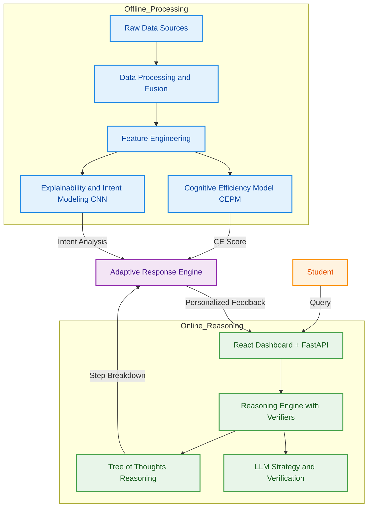

# CERAS — Cognitive Efficiency & Reasoning Alignment System

> [!CAUTION]
> **PROPRIETARY SOURCE CODE**
> This repository is protected by a proprietary license. Unauthorized copying, modification, or distribution is strictly prohibited. See [LICENSE](LICENSE) for details.


**CERAS** is a **Solver-Grounded, Multi-Verifier AI Tutor** that measures *cognitive learning readiness* in real-time. It goes beyond simple chatbots by "thinking" before it answers—using a **Tree-of-Thoughts (ToT)** architecture to decompose problems, verify logic, and adapt its teaching style based on the student's cognitive load....

---

## 🏗️ System Architecture

The core of CERAS is a **System 2 Reasoning Engine** that separates *planning* (decomposition) from *execution* (solving) and *verification*.



---

## 🚀 Key Features

### 1. **Professional AI Dashboard (React + Vite)**
-   **Modern React frontend** with a dark-mode glassmorphic design, replacing the original Streamlit UI.
-   **3-tier visual hierarchy**: Primary action elements (prompt, run button, CE score) have glow borders and strong shadows; analysis panels have reduced elevation; diagnostics/collapsibles are flat and minimal.
-   **Responsive single-column layout** with spacious vertical flow (max-width 960px).
-   **Animated loading overlay** with triple-ring brain spinner and pipeline stage indicators.

### 2. **Real-Time Typing Analytics**
-   **Keystroke tracking**: Total keystrokes captured via a custom `useTypingAnalytics` React hook.
-   **WPM (Words Per Minute)**: Live typing speed calculated from recent keystroke timestamps.
-   **Cognitive hesitation detection**: Pauses exceeding 2 seconds are flagged as hesitation events.
-   **Editing complexity (deletion ratio)**: Tracks backspace/delete vs. total keystrokes to measure editing behavior.
-   **Session duration timer**: Time elapsed since first keystroke, mapped to `formulation_time`.

### 3. **Live Prompt Quality Scoring**
-   **Client-side feature extraction** mirrors the backend's `extract_ceras_features` function for zero-latency feedback.
-   **Animated SVG radial gauge**: Overall prompt quality score (0–100%) with color-coded transitions.
-   **Feature progress bars**: Word count, sentence count, unique word ratio, and concept density.
-   **Prompt type classification**: Real-time badge showing Short / Medium / Detailed / Comprehensive.
-   **Typing dynamics strip**: WPM, keystrokes, hesitations, edit rate, and session time.

### 4. **Cognitive Efficiency Dashboard**
-   **Hero CE score card** (Tier 1): Large 200px dual-ring SVG gauge—inner ring shows fused CE score (animated 0→score on load), thin outer ring shows structural (blue) vs semantic (pink) dominance ratio.
-   **Layered center info**: Score value → label → delta from baseline (e.g., "+36 from baseline") → percentile estimate (e.g., "Top 10%").
-   **Score cards**: CEPM (structural), CNN (semantic), and Confidence sub-scores with animated bars.
-   **Metrics strip**: Formulation time, processing time, estimated tokens, features extracted, LLM calls.
-   **Diagnostic cards**: Two-column panel showing strengths and suggestions with icons.
-   **Adaptive learning summary**: Markdown-rendered personalized response based on CE score.
-   **Collapsible sections**: CE explanation, live telemetry & diagnostics, reasoning trace.
-   **Session report download**: Export full session data as a text file.

### 5. **Deep Reasoning Pipeline (ToT)**
Unlike standard LLMs, CERAS uses a structured **Tree-of-Thoughts** architecture:
1.  **Generate**: Proposes multiple high-level strategies and step-by-step plans.
2.  **Verify**: Each path is rigorously checked by a specialized "Verifier" model.
3.  **Select**: The optimal path is chosen based on verification scores.
4.  **Polish**: The final output is synthesized into a coherent learning response.

### 6. **Cognitive Efficiency Analysis**
The system evaluates your prompt using a fused multi-modal approach:
-   **CEPM (Structural)**: Measures complexity, density, and constraint adherence via LightGBM.
-   **CNN (Semantic)**: Analyzes intent clarity and alignment with high-performance patterns via TensorFlow/Keras.
-   **Fused Score**: A holistic 0–1 metric via the CERASFusion layer guiding the adaptive response engine.

### 7. **Multi-Provider LLM Support**
Seamlessly switch between top-tier models for both Reasoning and Verification:
-   **Groq**: Llama-3.3-70b (Versatile), Llama-3.1-8b (Instant), Qwen 2, Mixtral.
-   **Gemini**: Gemini 1.5 Pro, Gemini 1.5 Flash, Gemini 1.0 Pro.
-   **OpenAI**: GPT-4o, GPT-4o Mini, GPT-4 Turbo, GPT-3.5 Turbo.

---

## 🛠️ Tech Stack

| Component | Technology | Role |
| :--- | :--- | :--- |
| **Frontend** | **React + Vite** | Professional AI dashboard with live analytics |
| **Backend API** | **FastAPI** | REST API wrapping the Python reasoning pipeline |
| **LLM Providers** | **Groq, Google Gemini, OpenAI** | High-performance inference for reasoning & verification |
| **Orchestration** | **LangChain** | Advanced chain management and direct API integration |
| **ML Models** | **LightGBM / TensorFlow** | Cognitive Efficiency Prediction (CEPM) & CNN Feature Extraction |
| **Fusion** | **Pandas / NumPy** | Weighted averaging and logic-based score fusion |
| **Styling** | **Vanilla CSS** | Dark theme, glassmorphism, 3-tier elevation system |

---

## 📡 API Endpoints

| Method | Endpoint | Description |
| :--- | :--- | :--- |
| `GET` | `/api/health` | Server status, model loading state, timestamp |
| `GET` | `/api/logo` | CERAS logo image |
| `POST` | `/api/check-connection` | Validate an LLM provider API key |
| `POST` | `/api/run-session` | Full pipeline: reasoning → scoring → fusion |
| `POST` | `/api/adaptive-response` | Personalized learning summary based on CE score |

> Full request/response schemas with examples: see [API_DOCUMENTATION.md](API_DOCUMENTATION.md)
> Interactive Swagger UI: `http://localhost:8000/docs`

---

## 💻 Setup & Installation

### Prerequisites
-   Python 3.10+
-   Node.js 18+
-   At least one API key: **Groq**, **Gemini**, or **OpenAI**

### 1. Clone & Install Python Dependencies

```bash
git clone https://github.com/Wolfie8935/CERAS-Cognitive-Efficiency-Reasoning-Alignment-System.git
cd ceras
pip install -r requirements.txt
pip install fastapi uvicorn python-multipart
```

### 2. Install Frontend Dependencies

```bash
cd frontend
npm install
cd ..
```

### 3. Start the Backend (FastAPI)

```bash
python server.py
```

The server starts at `http://localhost:8000`. ML models load in the background.

### 4. Start the Frontend (Vite Dev Server)

```bash
cd frontend
npm run dev
```

Open `http://localhost:5173` in your browser.

### 5. Configure API Keys

Enter your API keys in the sidebar. The app validates them automatically.

---

## 📂 Project Structure

```text
.
├── server.py                   # FastAPI backend (API endpoints, model loading)
├── API_DOCUMENTATION.md        # Full API endpoint documentation
├── SETUP_COMMANDS.md           # Quick-start setup reference
├── frontend/                   # React + Vite frontend
│   ├── package.json
│   ├── vite.config.js          # Vite config with /api proxy to FastAPI
│   ├── index.html
│   └── src/
│       ├── main.jsx            # React entry point
│       ├── App.jsx             # Main app component (state, routing)
│       ├── App.css
│       ├── index.css           # Global design system (3-tier elevation)
│       ├── api.js              # API client module
│       ├── hooks/
│       │   └── useTypingAnalytics.js   # Typing dynamics capture hook
│       ├── data/
│       │   └── examples.js     # Example prompts & model lists
│       └── components/
│           ├── Sidebar.jsx     # API keys, model selection, connection status
│           ├── Header.jsx      # Logo & title with gradient
│           ├── PromptGuide.jsx # Expandable prompt writing tips
│           ├── ExampleCards.jsx# Good/bad prompt examples
│           ├── PromptInput.jsx # Textarea with typing analytics integration
│           ├── LivePromptScore.jsx  # Real-time prompt quality gauges
│           ├── Dashboard.jsx   # Cognitive efficiency results dashboard
│           ├── LoadingOverlay.jsx   # Pipeline loading animation
│           └── Footer.jsx      # Copyright & credits
├── src/ceras/                  # Core Python pipeline
│   ├── pipeline_1.py           # Tree-of-Thoughts reasoning engine
│   ├── llm_utils.py            # LLM provider utilities & prompts
│   ├── inference.py            # Multi-verifier validation pipeline
│   ├── fusion.py               # CEPM + CNN score fusion layer
│   ├── tree_of_thoughts.py     # ToT data structures & traversal
│   └── streamlit_app.py        # Legacy Streamlit UI
├── artifacts/                  # Pre-trained ML models & scalers
│   ├── cepm_lightgbm.pkl
│   ├── cepm_scaler.pkl
│   ├── cnn_ce_model.keras
│   ├── cnn_scaler.pkl
│   ├── cepm_features.npy
│   └── cnn_features.npy
├── assets/
│   └── ceras_logo.png
├── models/                     # Model training code (CEPM, CNN)
├── data/                       # Datasets & data processing
├── notebooks/                  # Jupyter notebooks for experimentation
└── tests/                      # Test suite
```

---

## 📜 License

**Copyright (c) 2026 Wolfie8935 and Rishaan08. All Rights Reserved.**

This software is provided for reference only. You may view the code, but you may not use, copy, modify, merge, publish, or distribute it without explicit written permission. See [LICENSE](LICENSE) for full text.
