# CERAS — Cognitive Efficiency & Reasoning Alignment System

CERAS is a research and prototype framework that measures **cognitive learning readiness** using hybrid AI systems such as **ANFIS**, **ANN**, and **Genetic Algorithms**.

## Setup
```bash
conda env create -f environment.yml
conda activate ceras
```


## Overview

**CERAS (Cognitive Efficiency & Reasoning Alignment System)** is a hybrid intelligent framework that models and measures an individual’s **learning readiness** by combining **Cognitive Efficiency (CE)** and **Reasoning Alignment (RA)**.

It unifies:
- **Neuro-Fuzzy Systems (ANFIS)** for interpretable rule-based reasoning,  
- **Neural Networks (ANN)** for adaptive pattern discovery,  
- **Genetic Algorithms (GA)** for optimal parameter and rule search,  
- **Large Language Models (LLMs)** via **LangChain + Ollama** for reasoning decomposition and verification.

The system evaluates **how efficiently** a learner processes information and **how closely** their reasoning aligns with domain experts — producing an interpretable, multi-dimensional *Learning Readiness Score (LRS)*.

---

## Objectives

1. **Measure Cognitive Efficiency (CE):** Quantify the learner’s speed, focus, and information-processing efficiency from behavioral signals.  
2. **Evaluate Reasoning Alignment (RA):** Compare the learner’s logical structure with expert reasoning trees using fuzzy-semantic scoring.  
3. **Decompose & Verify Reasoning:** Use an LLM-based *Reasoning Decomposer* and *Verifier* to generate and validate atomic subproblems from user queries.  
4. **Compute Learning Readiness Score (LRS):** Fuse CE and RA via a fuzzy-weighted inference engine.  
5. **Enable Explainability:** Produce interpretable rules and alignment graphs explaining *why* a learner scored high or low.  
6. **Deliver a Full Interactive System:** Deploy a web dashboard and API for exploration, live reasoning, and model interaction.

---

## Tech Stack Summary

| Layer | Tools / Frameworks | Purpose |
|-------|--------------------|----------|
| Language | **Python 3.12** | Core implementation |
| Orchestration | **LangChain (0.3.27)** + **Ollama** | Reasoning decomposition and verification |
| ML Frameworks | **PyTorch**, **Scikit-learn** | Neural & hybrid learning |
| Neuro-Fuzzy | **Custom ANFIS** | Interpretable fuzzy inference |
| Optimization | **Genetic Algorithm (GA)** | Membership function optimization |
| Vector Search | **FAISS**, **ChromaDB** | Reasoning memory and context retrieval |
| Interface | **Streamlit**, **FastAPI**, **Uvicorn** | Dashboard + REST API |
| Experimentation | **JupyterLab**, **Matplotlib**, **Seaborn** | Analysis & visualization |
| Logging & Config | **Loguru**, **PyYAML** | Config + monitoring |
| Deployment | **Docker**, **GitHub Actions** | CI/CD + reproducibility |

---

## System Architecture


## 🧮 Pipeline Flow (Stage-by-Stage)

| Stage | Module | Description | Output |
|--------|---------|--------------|----------|
| **1. Data Ingestion** | `src/ceras/data_loader.py` | Load raw behavioral, cognitive, and reasoning datasets from CSV/JSON sources. | Pandas DataFrame |
| **2. Preprocessing** | `src/ceras/features/featurize.py` | Clean, normalize, and engineer cognitive features (reaction time, accuracy, focus metrics). | Feature Matrix |
| **3. Feature Engineering & Quality Layer** | `src/ceras/features/feature_quality.py` | Apply temporal smoothing, embeddings, missingness modeling, and outlier detection. | Cleaned, aligned data tensors |
| **4. Cognitive Efficiency Modeling (CEPM)** | `src/ceras/models/cepm.py` | Sequence encoder (GRU) + XGBoost head for CE score prediction; explainable with SHAP. | **CE Score (0–100)** |
| **5. Reasoning Trace Segmentation** | `src/ceras/reasoning/trace_segmenter.py` | Segment reasoning logs or text traces into discrete cognitive steps. | Stepwise trace dataset |
| **6. Reasoning Decomposition** | `src/ceras/reasoning/decomposer.py` | LLM (`llm_utils.py`) breaks input problem into **atomic subtasks** via strict JSON: `{"subtasks": [...]}` | Subtask JSON |
| **7. Subtask Verification Loop** | `src/ceras/reasoning/verifier.py` | Separate LLM verifier evaluates subtask quality.<br>• If `{approved: true}` → forward to CAMRE<br>• If `{approved: false}` → re-decompose using feedback | Verified Subtasks |
| **8. CAMRE-EDU Reasoning Analysis** | `src/ceras/reasoning/camre_edu.py` | Builds reasoning tree-of-thoughts graph; aligns user reasoning with expert reference. | **RDS (0.0–1.0)** + Breakpoints |
| **9. Inference Engine** | `src/ceras/inference/engine.py` | Combines CE and RDS → fuzzy aggregation → Learning Readiness Score (LRS). | **LRS (0.0–1.0)** + Explanation Rules |
| **10. Interface Layer** | `src/ceras/interface/` (Streamlit / FastAPI) | Web UI for reasoning exploration, CE/RDS dashboards, and API endpoints. | Interactive Visualization |
| **11. Experiment Tracking & Reporting** | `experiments/run_experiment.py` | Logs model runs, visualizes CE–RDS correlation, generates analysis reports. | Logs, graphs, and summaries |

---

## 🔁 Reasoning Engine Loop

The Reasoning Engine has an internal **verification-feedback loop** for decomposition quality control.


**Key Points:**
- Decomposer: always returns JSON; failure raises exception (no fallback).  
- Verifier: ensures correctness and logical order of subtasks.  
- If the verifier rejects (`approved: false`), decomposition re-runs with structured feedback.  
- Loop terminates when `approved: true` or max attempts reached.

---

## 🔀 Integration with CEPM

After reasoning validation and CAMRE scoring:

```mermaid
flowchart LR
    CE["CEPM (Cognitive Efficiency Model)"] --> INFER["CERAS Inference Engine"]
    RDS["CAMRE-EDU RDS"] --> INFER
    INFER --> LRS["Learning Readiness Score (LRS)\n= f(CE, RDS)"]
    LRS --> DASH["Streamlit / API Dashboard\n→ Reports, Readiness Graphs, CE×RDS Analytics"]
```



**Learning Readiness Score (LRS)** is computed as:

\[
LRS = \alpha \times f(CE) + (1-\alpha) \times g(RDS)
\]

Where:
- `f()` and `g()` are fuzzy membership functions learned via ANFIS.  
- `α` is optimized using GA to balance efficiency vs reasoning.

---

## 📊 Key Outputs

| Metric | Description |
|---------|--------------|
| **CE (Cognitive Efficiency)** | Behavioral efficiency (0–100) |
| **RDS (Reasoning Divergence Score)** | Logical alignment with expert graph (0–1) |
| **LRS (Learning Readiness Score)** | Combined readiness indicator |
| **Breakpoints** | Reasoning divergence points |
| **Rule Confidence** | Fuzzy rule trust coefficient |
| **Interpretability Index** | Fraction of explainable rules |

---

## 🧠 Example Inference Output

```json
{
  "query": "How to develop an app in Flutter?",
  "subtasks": [
    "Define app structure and target features",
    "Set up Flutter environment and SDK",
    "Design UI components and navigation flow",
    "Connect backend APIs and manage state",
    "Test and debug on multiple devices",
    "Build release version and deploy to store"
  ],
  "verifier": {"approved": true, "confidence": 0.96},
  "RDS": 0.84,
  "CE": 79.3,
  "LRS": 0.87
}
```

---

## 🧩 File Mapping (Core Modules)

```
ceras/
├── data_loader.py
├── preprocess/                      
│   ├── __init__.py    
│   ├── signal_fusion.py            
│   └── auditor.py                  
│       
│
├── features/
│   ├── featurize.py
│   └── feature_quality.py
│
├── models/
│   ├── cepm.py
│   ├── anfis.py
│   └── ann.py
│
├── postprocess/                     
│   ├── __init__.py
│   ├── calibrator.py               
│   ├── insights.py               
│   └── model_monitor.py      
│
├── infra/                          
│   ├── __init__.py
│   ├── experiment_tracking.py       
│   └── llm_queue.py                 
│
├── reasoning/
│   ├── llm_utils.py
│   ├── decomposer.py
│   ├── verifier.py
│   └── camre_edu.py
│
├── inference/
│   ├── engine.py
│   └── fusion.py                  
│
├── interface/
│   ├── streamlit_app.py
│   └── fastapi_app.py
│
├── experiments/
│   ├── run_experiment.py
│   └── synthetic_benchmarks.py     
│
├── monitoring/                       
│   ├── __init__.py
│   ├── alerts.py                    
│   └── reports.py                  
│
└── tests/
    ├── test_preprocess.py           
    ├── test_postprocess.py        
    └── test_synthetic_benchmarks.py
```

---
