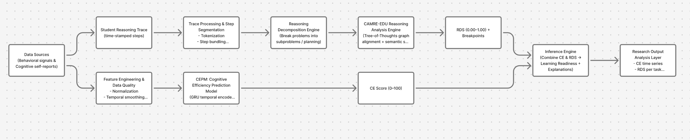

# CERAS — Cognitive Efficiency & Reasoning Alignment System

## 🔍 Overview

**CERAS (Cognitive Efficiency & Reasoning Alignment System)** is a hybrid intelligent framework designed to measure and model an individual’s **learning readiness** and **reasoning alignment** with expert cognitive structures.

It combines principles from:
- **Neuro-Fuzzy Systems (ANFIS)** for interpretable rule-based learning,
- **Neural Networks (ANN)** for adaptive pattern discovery,
- **Genetic Algorithms (GA)** for optimization of parameters and rule selection,
to create a unified system that balances **explainability** and **performance**.

CERAS aims to quantify how efficiently an individual processes information and how closely their reasoning aligns with domain-expert reasoning pathways — useful for education, cognitive assessment, and AI tutoring systems.

---

## 🎯 Objectives

1. **Measure Cognitive Efficiency:** Quantify how effectively a learner absorbs and processes information using behavioral and task-level metrics.  
2. **Evaluate Reasoning Alignment:** Compare the learner’s logical structure and inference steps with an expert model using pattern-matching and fuzzy reasoning.  
3. **Generate a Learning Readiness Score (LRS):** Provide a single interpretable score (0–1) combining efficiency and alignment metrics.  
4. **Build an Explainable AI Model:** Derive human-readable fuzzy rules explaining why a learner scores high or low.  
5. **Develop an Interactive Interface:** Build a Streamlit dashboard and FastAPI backend to visualize results and test the model with real data.  

---

## 🧩 Tech Stack Summary

| Layer | Tools / Frameworks | Purpose |
|-------|--------------------|----------|
| Language | **Python 3.12** | Core development |
| Environment | **Conda** | Dependency & version management |
| Model | **LangChain (0.3.27)**, **PyTorch**, **Scikit-learn** | Model orchestration, learning & inference |
| Neuro-Fuzzy | **Custom ANFIS implementation** | Hybrid learning |
| Optimization | **Genetic Algorithms (GA)** | Parameter tuning |
| Vector Storage | **FAISS**, **ChromaDB** | Semantic reasoning data |
| Interface | **Streamlit**, **FastAPI**, **Uvicorn** | Visualization & API service |
| Logging & Config | **Loguru**, **Pyyaml** | Monitoring & config management |
| Experimentation | **JupyterLab**, **Matplotlib**, **Seaborn** | Data analysis, visualization |

---

## ⚙️ System Architecture



## 🧮 Pipeline Flow (End-to-End)

| Stage | Module | Description | Output |
|--------|---------|--------------|----------|
| **1. Data Ingestion** | `src/ceras/data_loader.py` | Load CSV / JSON cognitive task data | Pandas DataFrame |
| **2. Preprocessing** | `src/ceras/features/featurize.py` | Clean, normalize, engineer cognitive and reasoning metrics | Feature Matrix |
| **3. Model Training** | `src/ceras/models/anfis.py` & `src/ceras/models/ann.py` | Train hybrid models (ANFIS, ANN, GA) on efficiency and reasoning data | Trained model weights |
| **4. Evaluation** | `src/ceras/eval/metrics.py` | Evaluate accuracy, interpretability, and alignment | Metrics Report |
| **5. Reasoning Alignment Analysis** | `src/ceras/reasoning_analysis.py` | Compare user reasoning vs expert structure using fuzzy logic | Alignment Scores |
| **6. Visualization / Interface** | Streamlit & FastAPI | Provide dashboard and REST API for interactive testing | Web Interface |
| **7. Experiment Tracking** | `experiments/run_experiment.py` | Log results and compare models automatically | Logs / Plots / Reports |

---

## 🧠 Key Components

### 1. Data Layer
- **Sources:** Cognitive test datasets, reasoning transcripts, performance logs.
- **Structure:**  
  - `data/raw` → unprocessed datasets  
  - `data/processed` → cleaned, normalized features  
- **Goal:** Transform human reasoning and performance logs into model-ready features.

### 2. Feature Layer
- Feature extraction for:
  - Response time, accuracy
  - Stepwise reasoning patterns
  - Semantic similarity to expert reasoning  
- Stored as vectors for hybrid neuro-symbolic modeling.

### 3. Model Layer
- **ANFIS:** Learns fuzzy rules for reasoning efficiency.
- **ANN:** Learns nonlinear interactions among features.
- **GA:** Optimizes membership function parameters for ANFIS and model hyperparameters.
- Supports **comparison experiments** between each model.

### 4. Evaluation Layer
- Metrics include:
  - Cognitive Efficiency Score (CES)
  - Reasoning Alignment Score (RAS)
  - Learning Readiness Index (LRI = f(CES, RAS))
- Each prediction explained via top fuzzy rules (“why this score?”).

### 5. Interface Layer
- **Streamlit Dashboard:** Interactive visualization of scores and explanations.
- **FastAPI Service:** Provides REST endpoints for model inference and data submission.

### 6. Deployment & CI/CD
- Dockerized app for reproducible deployment.
- GitHub Actions for:
  - Linting (`ruff`, `black`)
  - Testing (`pytest`)
  - Model training pipelines
  - Auto-deploy to Streamlit Cloud / Hugging Face Spaces

---

## 📊 Evaluation Metrics

| Metric | Description |
|---------|--------------|
| **RMSE** | Measures prediction error of learning readiness |
| **Fuzzy Rule Confidence** | Degree of trust in fuzzy inference |
| **Reasoning Divergence Index (RDI)** | Quantifies deviation from expert logic |
| **Cognitive Efficiency Ratio (CER)** | Ratio of expected vs actual performance |
| **Interpretability Index (II)** | Number of understandable rules / total rules |

---

## 🚀 Deliverables

| Phase | Deliverable | Description |
|--------|--------------|--------------|
| Phase 1 | **Data Pipeline + Baseline Model** | CSV ingestion, preprocessing, simple ANN baseline |
| Phase 2 | **ANFIS Module** | Fuzzy rule generation and hybrid learning implementation |
| Phase 3 | **GA Optimizer** | Genetic algorithm optimizer for fuzzy parameters |
| Phase 4 | **Evaluation Suite** | Metrics, logging, comparison dashboard |
| Phase 5 | **Interface + API** | Streamlit dashboard + FastAPI endpoints |
| Phase 6 | **Final Report & Docs** | Paper, presentation, reproducibility package |

---

## 🧩 Example Output (Conceptual)

```json
{
  "user_id": "L123",
  "cognitive_efficiency": 0.82,
  "reasoning_alignm_
