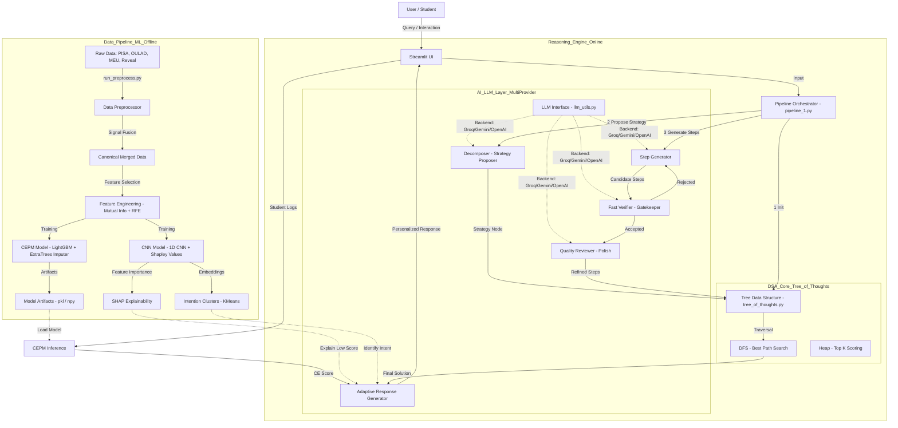

# CERAS Architecture: Cognitive Efficiency & Reasoning Alignment System

This document outlines the final architecture for CERAS, highlighting the integration of **Data Pipelines**, **DSA (Data Structures & Algorithms)**, **ML (Machine Learning)**, and **AI (Generative Reasoning)**.

## High-Level Architecture

The system is designed as a **Solver-Grounded, Multi-Verifier Tree-of-Thoughts (ToT)** framework that combines robust data processing with adaptive AI reasoning. It now supports multiple LLM backends (Groq, Gemini, OpenAI) for both reasoning and verification.

## Detailed Component Analysis

### 1. Multi-Provider AI Layer
The generative layer has been evolved to be **provider-agnostic**, supporting high-performance models across different services.

*   **Supported Providers**:
    *   **Groq**: Llama-3.3-70b (Versatile), Llama-3.1-8b (Instant) - *Primary for speed*.
    *   **Google Gemini**: Gemini 1.5 Pro, Gemini 1.5 Flash, Gemini 2.0 - *Primary for context window and reasoning*.
    *   **OpenAI**: GPT-4o, GPT-4o-mini, o1-preview - *Primary for complex reasoning fallback*.
*   **Orchestration (`pipeline_1.py`)**: Implements a **System 2** thinking process:
    1.  **Decomposition**: Breaks down complex problems into strategies using the chosen main model.
    2.  **Solver Step Generation**: Generates actionable steps for each strategy.
    3.  **Fast Verification**: A lightweight check (often using smaller models like Llama-3.1-8b or Gemini Flash) to ensure basic completeness.
    4.  **Quality Review**: A strict review pass that fixes logic errors or missing steps.
    5.  **Adaptive Response**: Uses the **CE Score** and **SHAP insights** to adjust the *tone*, *complexity*, and *content* of the explanation.

### 2. Data Structures & Algorithms (DSA)
The "Heart" of the reasoning engine relies on explicit DSA implementations rather than just black-box LLM calls.

*   **Tree Data Structure (`tree_of_thoughts.py`)**:
    *   **Nodes (`ThoughtNode`)**: Represents strategies, steps, or refinements. Contains metadata, scores, and parent/child references.
    *   **Tree Management**: Custom implementation to manage the reasoning state, distinct from the LLM's context window.
*   **Algorithms**:
    *   **DFS (Depth-First Search)**: Used in `best_path()` to traverse the thought tree and find the highest-scoring reasoning path.
    *   **Heaps (Priority Queues)**: Used in `top_k_by_score` via Python's `heapq` module to efficiently retrieve the best thoughts/nodes.

### 3. Machine Learning (ML) & Explainability
Traditional ML provides the "Cognitive Efficiency" metric, while Deep Learning provides the interpretability and intention modeling.

*   **CEPM (Cognitive Efficiency Prediction Model)**:
    *   **Algorithm**: **LightGBM Regressor** (`LGBMRegressor`) for high-performance, gradient-boosted regression of student efficiency scores.
    *   **Imputation**: **ExtraTreesRegressor** used within `IterativeImputer` to handle missing student data intelligently.
*   **CNN Model (Explainability & Intention)**:
    *   **Architecture**: **1D-CNN** (`Conv1D`, `MaxPooling`) designed to process sequences of behavioral features.
    *   **Intention Clustering**: Applying **K-Means** on the CNN embeddings reveals "Intention Clusters" (e.g., "Guessing", "Systematic Solving", "Struggling").
    *   **SHAP Analysis**: Uses **Shapley Additive Explanations** to tell us *why* a student has a low score (e.g., "high idle time", "rapid clicking").

### 4. User Interface (Streamlit)
*   **Dynamic Configuration**: Real-time switching between LLM providers (Groq/Gemini/OpenAI) via the sidebar.
*   **Telemetry Dashboard**: Live tracking of token usage, latency, and cognitive metrics.
*   **Adaptive Feedback**: Displays the "Fused CE Score" and provides tailored advice based on the interaction.

---

## Project Workflow & Reality
How the project is actually panning out:

1.  **The "Brains" (AI)**: We have moved to a **Model-Agnostic Agentic Tutor**. The AI doesn't just guess; it *thinks* (via Tree of Thoughts), *verifies* (via Multi-Verifier), and *adapts* (via CEPM), utilizing the best model for each specific sub-task (e.g., Llama 3 for speed, GPT-4o for complex logic).
2.  **The "Eyes" (ML)**: The system "sees" the student not just through text, but through behavior. The **CNN + SHAP** layer acts as a diagnostic tool, turning raw clicks/time into actionable insights ("You seem to be rushing").
3.  **The "Spine" (DSA)**: We aren't relying on the LLM to hold state. We use a rigid **Tree Data Structure** to ensure the reasoning process is robust, backtrackable, and audit-able.
4.  **The Feedback Loop**:
    *   **Student** interacts $\to$ **Logs** generated.
    *   **ML** predicts lower efficiency $\to$ **CNN** identifies "Rushing" cluster.
    *   **AI** adapts tone to be "Supportive" and adds a specific warning: "I noticed you're moving fast. Let's slow down and check this step."
